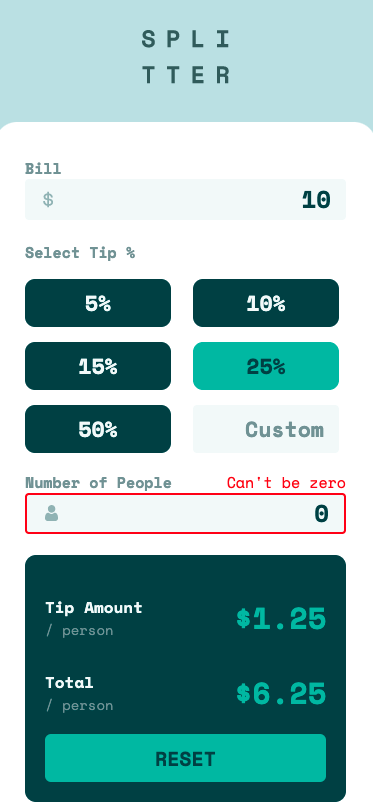
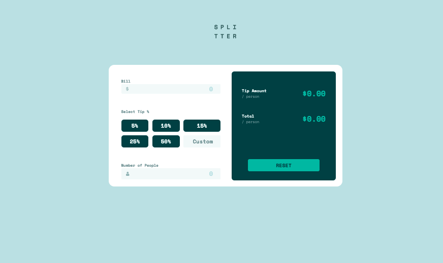

# Frontend Mentor - Tip calculator app solution

This is a solution to the [Tip calculator app challenge on Frontend Mentor](https://www.frontendmentor.io/challenges/tip-calculator-app-ugJNGbJUX). Frontend Mentor challenges help you improve your coding skills by building realistic projects.

## Table of contents

- [Overview](#overview)
  - [The challenge](#the-challenge)
  - [Screenshot](#screenshot)
  - [Links](#links)
- [My process](#my-process)
  - [Built with](#built-with)
  - [What I learned](#what-i-learned)
  - [Continued development](#continued-development)
  - [Useful resources](#useful-resources)
- [Author](#author)
- [Acknowledgments](#acknowledgments)

## Overview

### The challenge

Users should be able to:

- View the optimal layout for the app depending on their device's screen size
- See hover states for all interactive elements on the page
- Calculate the correct tip and total cost of the bill per person

### Screenshot

mobile (iphone x)        |  desktop
:-------------------------:|:-------------------------:
 |  

### Links

- Live Site URL: [Live Site](https://ttttristan.github.io/tip-calculator-app-main)

### Built with

- Semantic HTML5 markup
- CSS custom properties
- Flexbox
- CSS Grid
- Mobile-first workflow

### What I learned

avoid using complex css selectors 
plan out containers for both mobile and desktop

### Continued development

Continue learning more about best practices for styling. Using classes and id's more deliberately during the planning process.   

### Useful resources

- [How to write truly terrible CSS
](https://www.freecodecamp.org/news/how-to-write-truly-terrible-css-214c26c6f729/) - Avoid using complex css selectors

## Author

- Frontend Mentor - [@yourusername](https://www.frontendmentor.io/profile/yourusername)

